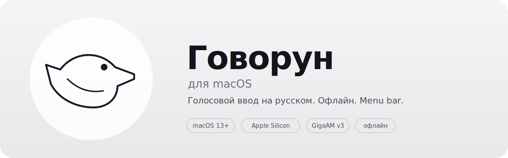
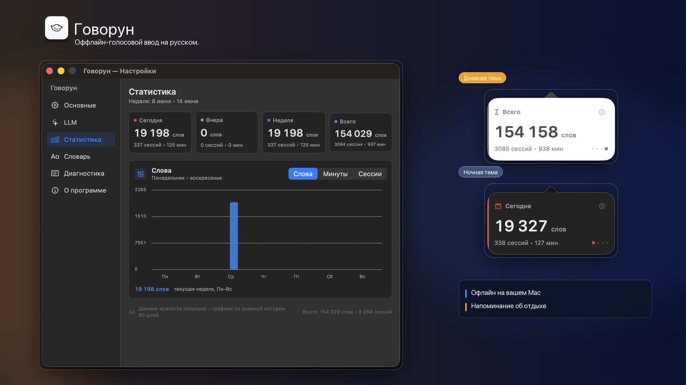

<p align="center">
  
</p>

# Говорун для macOS

Диктовка на русском для macOS — та же идея, что в [Говоруне для Android](https://github.com/amidexe/govorun-lite), переработанная под Mac. В основе — GigaAM v3 от Сбера и Silero VAD. Минималистичная menu bar-утилита без лишнего.

> ⚠️ **Ранняя стадия разработки.** Приложение активно дорабатывается — жду ваших отзывов. Если поймали ошибку или странное поведение, напишите, пожалуйста, в [Issues](https://github.com/amidexe/govorun-osx/issues) — это помогает и ускоряет починку.

## Скриншоты

<p align="center">
  
</p>

## Установка

1. Скачайте **govorun.dmg** из [Releases](https://github.com/amidexe/govorun-osx/releases/latest)
2. Откройте DMG и перетащите приложение в папку «Программы»
3. При первом запуске следуйте инструкции ниже

### Первый запуск

Приложение не подписано сертификатом Apple, поэтому macOS заблокирует его при первом запуске. Зайдите в **Системные настройки → Конфиденциальность и безопасность** — внизу появится кнопка «Всё равно открыть».

Если macOS пишет, что приложение «повреждено» и сразу отправляет его в Корзину, снимите карантинный атрибут в Терминале — после этого запустите обычным способом:

```bash
xattr -cr /Applications/Говорун.app
```

## GigaAM v3 — движок

[GigaAM v3](https://github.com/salute-developers/GigaAM) — модель от Сбера, обученная специально на русском языке. На macOS Говорун сначала пробует CoreML через sherpa-onnx/ONNX Runtime, а если провайдер недоступен — падает обратно на CPU. Всё распознавание остаётся локальным: звук не отправляется на сервер.

[Silero VAD](https://github.com/snakers4/silero-vad) нарезает речь на фрагменты по паузам и отдаёт каждый в GigaAM немедленно — не дожидаясь конца записи. Текст появляется практически в реальном времени.

## Как пользоваться

1. Иконка птицы живёт в menu bar. Горячая клавиша по умолчанию — `Right ⌥` (меняется в настройках).
2. Зажмите и говорите (PTT) — или нажмите один раз и говорите до следующего нажатия.
3. Текст вставляется туда, где курсор — в любом приложении.

Используется микрофон по умолчанию из системных настроек — менять ничего не нужно.

## Напоминание об отдыхе

Говорун считает минуты речи за день и может напомнить об отдыхе. Птичка меняет цвет во время записи:

⚪ — всё в порядке · 🟡 — усталость накапливается · 🔴 — слишком много за день, возьми паузу

Функция выключена по умолчанию, пороги настраиваются под свой темп.

## Дополнительно

**Словарь замен.** Правила вида `апи = API`, `докер = Docker`, `кхм =` — применяются к каждой фразе автоматически, если словарь включён в настройках.

**LLM-стилизация.** Опциональная постобработка через языковую модель — убирает слова-паразиты, расставляет знаки препинания, исправляет термины. Работает с Ollama, OpenAI и Gemini. По умолчанию выключена.

**Диагностика.** В настройках есть лёгкий журнал последних событий: права macOS, запуск, распознавание, LLM и прокси. Текст диктовки и API-ключи в журнал не сохраняются.

## Приватность

Распознавание речи — полностью офлайн, звук не покидает устройство. LLM-стилизация, если включена, отправляет текст только к тому серверу, который вы сами указали. API-ключи хранятся в Keychain macOS.

## Сборка из исходников

```bash
brew install xcodegen
make setup    # скачивает sherpa-onnx и GigaAM (~460 МБ, один раз)
make build install
```

Зависимости берутся из официальных источников: [sherpa-onnx v1.13.1](https://github.com/k2-fsa/sherpa-onnx/releases/tag/v1.13.1) с GitHub, модель с [HuggingFace](https://huggingface.co/istupakov/gigaam-v3-onnx).

## Известные проблемы

> ⚠️ **Говорун написан одним человеком для себя и распространяется как есть.** Возможны редкие сбои — пользуйтесь с пониманием этого.

- **Редкое зависание интерфейса.** В отдельных случаях окно «Настройки» может зациклиться на пересчёте раскладки (баг SwiftUI): приложение перестаёт реагировать и нагружает процессор. Начиная с **v1.0.4** встроен сторож: если интерфейс завис дольше ~30 секунд, Говорун сам завершается, чтобы не греть процессор и не сажать батарею. Если такое случилось — просто запустите приложение заново.
- **Если иконка «зависла».** Перетаскивание значка из menu bar **не** завершает процесс. Полностью закрыть приложение можно пунктом «Завершить Говорун» в меню (правый клик по иконке) или командой в Терминале:

  ```bash
  killall Говорун
  ```

Нашли сбой — заведите [issue](https://github.com/amidexe/govorun-osx/issues), это помогает.

## Об ограничениях

GigaAM v3 отлично работает на чистом русском. Английские слова и термины в потоке речи — её слабое место. Словарь замен и LLM-промпт частично компенсируют это. Говорун написан для себя — для задачи «надиктовать мысль по-русски» работает хорошо.

## Об авторе

**Дмитрий Киселев** — [@amidexe](https://github.com/amidexe)

## Лицензия

MIT — см. [LICENSE](LICENSE). Сторонние компоненты: [THIRD_PARTY_LICENSES.txt](THIRD_PARTY_LICENSES.txt).
